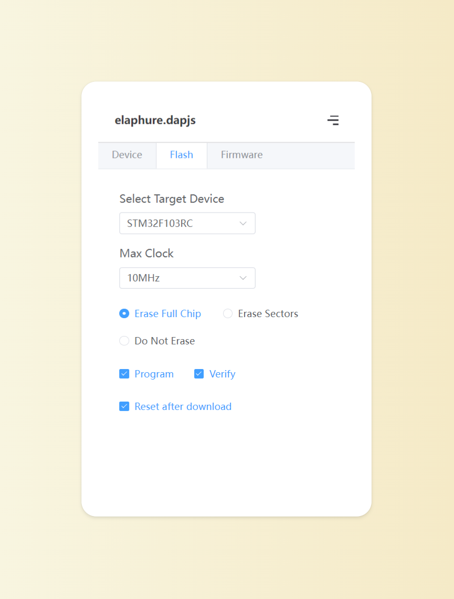

# elaphure.dapjs



Online ARM Cortex-M firmware flash based on dap.js

[🌐 Try it Online](http://dapjs.airkyi.com/)

## Features

- 📦 Easy to use.
- ⛏️ Supports multiple microcontrollers.
- 🔌 Supports downloads via WebUSB.
- 📡 Supports wireless downloads via WebSocket.

## Wireless Download

Wireless download using the espressif series chip:

https://github.com/windowsair/wireless-esp8266-dap

## Browser Compatibility

Browsers like Safari and Firefox do not support the WebUSB feature. For more information, see [WebUSB browser compatibility](https://developer.mozilla.org/en-US/docs/Web/API/USB#browser_compatibility)

WebSocket features are supported by all modern browsers.

WebSocket does not support TLS.

## Add new device

Creating an [issue](https://github.com/windowsair/elaphure-dap.js/issues) or check document: [How to add new device](./device/README.md)

## Develop

Use Vite to build:

```bash
npm i
npm run dev
```

## Deploy

WebUSB needs to be executed in a secure context, so HTTPS must be enabled.

WebSocket does not support TLS, so it needs to be executed in an HTTP context.

Trusted domains like `localhost` are not affected by the above browser security policy.

